# 软件工程 — 知识点详解

---

## （一）软件工程概念与软件工程的基本要素

### 1.1 软件工程的定义

- **软件工程**：将系统化的、规范的、可量化的方法应用于软件的开发、运行和维护的学科。
- **软件 = 程序 + 数据 + 文档**
- **软件的特点**：软件是逻辑产品而非物理产品；软件不会"磨损"，但会"退化"（环境变化）。

### 1.2 软件危机

- **表现**：开发进度和成本难以控制、质量难以保证、维护困难。
- **原因**：软件规模增大、复杂度增加、缺乏工程化管理。

> **真题考点：软件工程概述**
> - **开源软件**：源代码可被公众自由获取、修改、分发的软件，遵循开源许可协议（如 GPL、MIT）。例：Linux 操作系统。（2020 真题）
> - **Web 应用软件**：基于 B/S 架构、通过 HTTP/HTTPS 协议运行的软件系统。经典示例：电子商务类（淘宝）、信息资讯类（新浪）。（2021 真题）
> - **软件的正确性**：指软件达到预期功能的程度（B 选项"达到预期功能的程度"），而非"不出现任何错误"。（2012 真题）

### 1.3 软件工程的基本要素

- **方法**：完成软件开发各阶段任务的技术方法（"怎么做"）。
- **工具**：支持方法的自动化或半自动化的工具。
- **过程**：将方法和工具综合起来以达到合理、及时进行软件开发的目的。

### 1.4 软件工程的基本原则

- 抽象、信息隐藏、模块化、局部化、一致性、完备性、可验证性。

---

## （二）软件过程

### 2.1 软件生存周期过程

软件从需求提出到软件废弃的整个过程。

**三个大类**：
1. **基本过程**：获取、供应、开发、运行、维护。
2. **支持过程**：文档编制、配置管理、质量保证、验证、确认、联合评审、审计、问题解决。
3. **组织过程**：管理、基础设施、改进、培训。

> **真题考点**：基本过程按活动主体分为：获取过程（需求方）、供应过程（供应方）、开发过程（开发方）、运行过程（操作方）、维护过程（维护方）。（2018 真题）
>
> **软件配置管理**是一种保护伞活动，贯穿整个软件生存周期，用于控制变更。（2014 真题）

### 2.2 软件生存周期模型

**瀑布模型（Waterfall）**：
- 阶段：需求分析 → 系统设计 → 详细设计 → 编码 → 测试 → 运行维护。
- 特点：线性顺序，每个阶段完成后才进入下一阶段。
- 优点：文档齐全、里程碑清晰。
- 缺点：需求必须明确、难以回溯、用户要等到最后才能看到产品。

> **真题考点：软件过程模型选择**
> - **瀑布模型**是软件过程模型（非产品/项目/测试模型）。（2014 真题）
> - 需求明确时适用瀑布模型。（2012 真题）
> - 大型系统且需求可能变化时，瀑布模型不是最好选择。（2020 真题）
> - **增量模型**开发活动包含增量分析、增量设计、增量实现，不含"增量发布"。（2013 真题）
> - 增量模型不直接有利于模块划分。（2018 真题）

> **真题考点：敏捷过程模型**（2025 真题）
> - 敏捷是**迭代增量**开发过程，消除不必要的**文档**，将分析、设计、编码、测试**结合**在一起，采用**迭代增量**开发策略。

> **真题考点：螺旋模型与喷泉模型**（2022 真题）
> - 螺旋模型在瀑布和演化基础上增加了**风险分析**，建立在**原型**基础上
> - 喷泉模型描述**面向对象**的开发模型，体现**迭代**和**开发各阶段之间无间隙**的特征

> **真题考点：RUP**（2020 真题）
> - RUP 中"谁做"→**角色**（B），"怎么做"→工作流，"做什么"→制品
> - 6 个核心工程工作流：业务建模、需求、分析与设计、实现、测试、部署

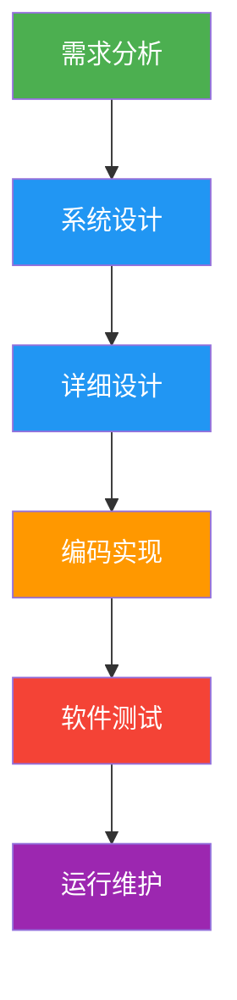

**增量模型（Incremental）**：
- 将软件分解为多个增量，每个增量经历完整的开发过程。
- 先交付核心功能，逐步增加新功能。
- 优点：早期交付、降低风险。
- 缺点：需要良好的架构设计。

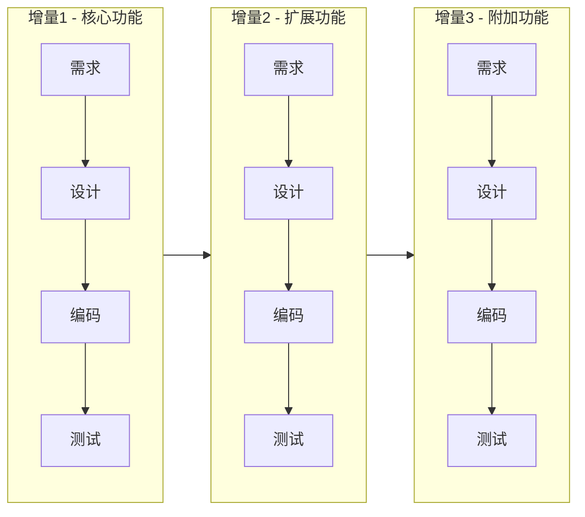

**演化模型（Evolutionary）**：
- 通过迭代逐步完善软件，每次迭代都经历完整的开发周期。
- 适合需求不明确的情况。

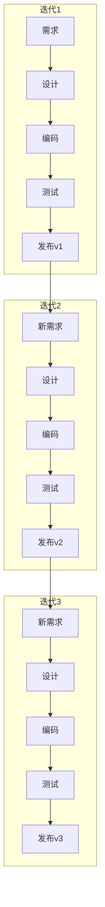

**螺旋模型（Spiral）**：
- Boehm 提出，将瀑布模型和演化模型结合，增加**风险分析**。
- 每一圈包含四个阶段：确定目标/替代方案 → 风险评估/原型 → 开发/验证 → 计划下一圈。
- 优点：风险驱动、适合大型项目。
- 缺点：需要风险评估经验。

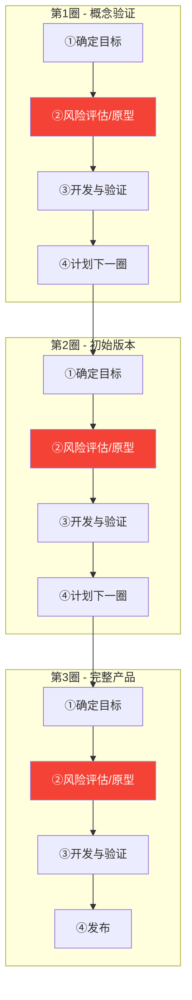

**喷泉模型（Fountain）**：
- 面向对象的开发模型，支持迭代和无间隙性。
- 各阶段可以重叠和反复。
- 以用户需求为动力，以对象为驱动。

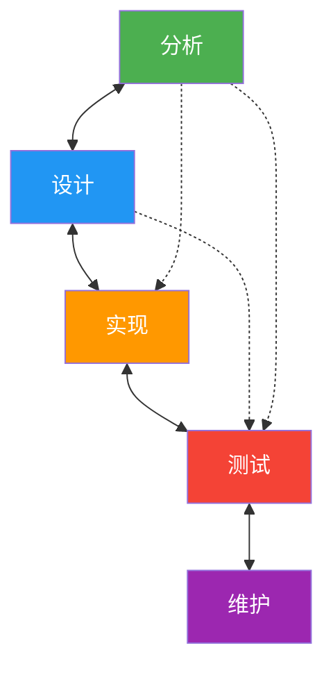

**其他模型**：
- **V 模型**：瀑布模型的变体，强调测试与开发的对应关系。

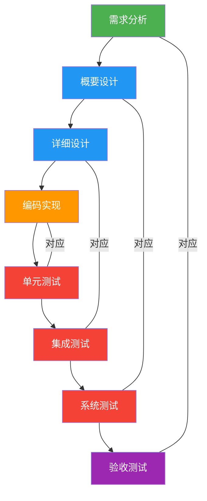

- **敏捷开发**：Scrum、XP（极限编程）、看板方法。强调快速迭代、用户参与、拥抱变化。

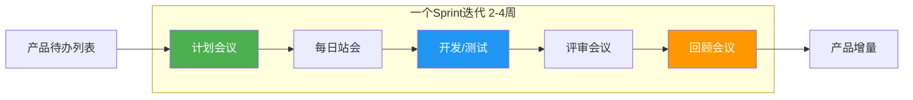

- **DevOps**：开发和运维一体化，持续集成/持续交付（CI/CD）。

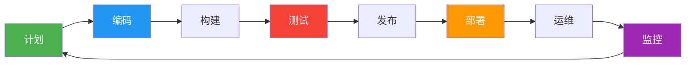

### 2.3 软件项目生存周期过程的规划与监控

- **项目规划**：确定项目范围、制定计划、分配资源。
- **项目监控**：跟踪进度、控制变更、风险管理。
- 里程碑：项目进度中的重要检查点。

### 2.4 能力成熟度模型（CMM）

**CMM（Capability Maturity Model）**：评估软件开发过程成熟度的模型。

**五个等级**：

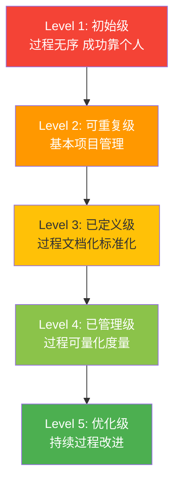
> 📊 CMM五级成熟度模型（由低到高逐级提升）

| 等级 | 名称 | 特征 | 关键过程域 |
|------|------|------|------------|
| 1 | 初始级 | 过程无序，成功靠个人 | 无 |
| 2 | 可重复级 | 有基本的项目管理 | 需求管理、项目计划、项目跟踪、子合同管理、质量保证、配置管理 |
| 3 | 已定义级 | 过程已文档化和标准化 | 组织过程焦点、组织过程定义、培训、集成软件管理、软件产品工程、组间协调、同行评审 |
| 4 | 已管理级 | 过程可量化度量和控制 | 定量过程管理、软件质量管理 |
| 5 | 优化级 | 持续过程改进 | 缺陷预防、技术变更管理、过程变更管理 |

**CMM 的内部结构**：

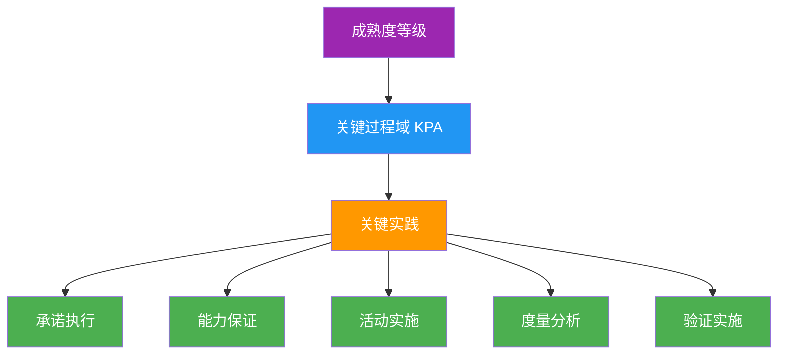
> 📊 CMM内部结构：成熟度等级 → 关键过程域 → 关键实践 → 共同特征

**CMMI（Capability Maturity Model Integration）**：CMM 的集成版本，支持两种表示法——阶段式（类似 CMM）和连续式。

### 2.5 CMM 在实际项目中的应用

> 每个等级不是"考试分数"，而是对组织过程管理能力的客观评估。理解每一级"具体做什么"才能把握 CMM 的本质。

**Level 1 初始级 —— "英雄主义开发"**

一个学生团队做大作业，没有固定流程，谁想到了就做。某个同学能力很强，项目就成功；换一批人，同样的项目可能就失败了。

- **典型场景**：项目没有计划、没有文档，全靠口头沟通，代码在QQ群里传来传去。
- **核心问题**：成功不可复制，完全依赖个人能力。

**Level 2 可重复级 —— "有了基本的项目管理"**

团队开始用 Git 管理代码，每次开会写个简单的会议纪要，上线前有个检查清单。

- **典型场景**：
  - **需求管理**：用 Excel 记录需求列表，每条需求有状态（待开发/开发中/已完成）。
  - **项目计划**：用甘特图排期，明确谁做哪个模块。
  - **项目跟踪**：每周开例会，对照计划看进度偏差。
  - **配置管理**：代码用 Git 管理，有基本的分支策略（master / dev）。
  - **质量保证**：上线前按照检查清单逐项确认。
- **核心能力**：类似项目的经验可以被复用（"可重复"的含义）。

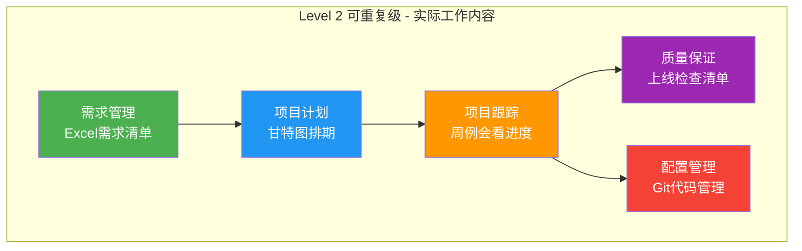

**Level 3 已定义级 —— "有标准流程，全员遵守"**

公司编写了《软件开发规范手册》，所有项目必须按照统一的标准流程执行。

- **典型场景**：
  - **组织过程定义**：制定了标准的需求分析模板、设计文档模板、代码规范、测试规范。
  - **培训制度**：新人入职必须参加"开发流程培训"，通过考核后才能参与项目。
  - **同行评审**：代码合并前必须由至少一位同事做 Code Review。
  - **集成软件管理**：从需求到上线有完整的工具链（Jira 需求 → GitLab 代码 → Jenkins 构建 → SonarQube 检查）。
  - **软件产品工程**：每个阶段有明确的产出物和验收标准。
- **核心能力**：组织有了统一的过程资产，不因人员变动而丧失能力。

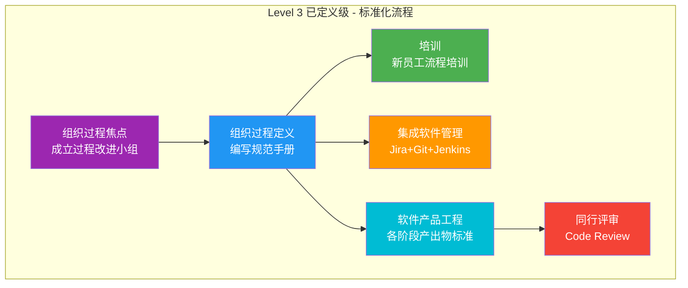

**Level 4 已管理级 —— "用数据说话"**

团队不再凭感觉判断项目状态，而是用量化的指标来度量和管理。

- **典型场景**：
  - **定量过程管理**：统计每个阶段的平均耗时、缺陷密度、代码评审通过率。
    - 例如："过去6个月，需求分析平均耗时12天，允许偏差±2天"。
    - 如果某个项目需求分析超过14天，自动触发预警。
  - **软件质量管理**：设定质量目标并量化跟踪。
    - 例如："千行代码缺陷率 ≤ 2.0"、"测试用例通过率 ≥ 95%"。
    - 通过控制图（Control Chart）监控质量指标是否在可控范围内。
- **核心能力**：过程可预测、可量化控制，异常能被及时发现。

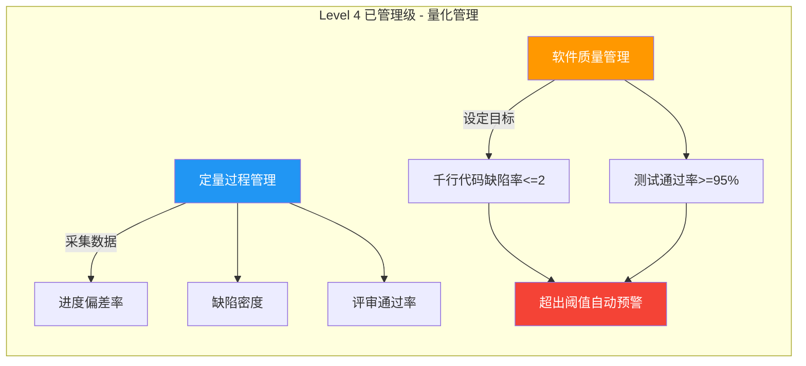

**Level 5 优化级 —— "持续改进，永不满足"**

团队建立了持续改进的机制，主动寻找过程弱点并优化。

- **典型场景**：
  - **缺陷预防**：每个版本上线后召开"缺陷根因分析会"（Root Cause Analysis）。
    - 发现"需求理解偏差"占缺陷的40% → 制定措施：需求评审时必须由测试人员参与。
  - **技术变更管理**：有计划地引入新技术。
    - 例如：评估将手动测试转为自动化测试的投资回报率，分阶段推进。
  - **过程变更管理**：定期评估流程，持续优化。
    - 例如：每季度做一次"过程审计"，识别瓶颈环节并改进。
- **核心能力**：组织具备自我进化的能力，过程不断优化。

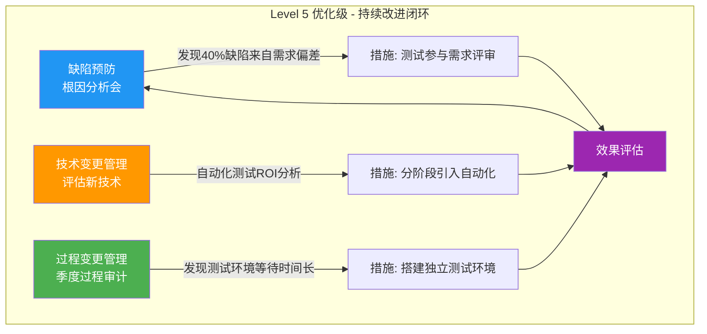

**CMM 等级提升路径总结**：

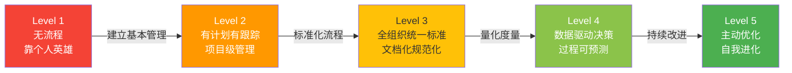

> **考试提示**：CMM 考点常考"某个做法属于哪个等级"。判断依据：有数据→4级以上；有标准文档→3级以上；只有基本管理→2级；啥都没有→1级。

---

## （三）软件需求与软件需求规约

### 3.1 软件需求的定义和分类

- **功能需求**：系统应该"做什么"。
- **非功能需求**：系统的性能、安全性、可靠性、可用性等质量属性。
- **用户需求**：从用户角度描述的需求。
- **系统需求**：更详细的技术描述。

### 3.2 常用的需求发现技术

- **访谈**：与用户面对面交流。
- **问卷调查**：大规模收集需求。
- **观察**：观察用户的工作流程。
- **文档分析**：分析现有文档和系统。
- **原型法**：构建原型帮助用户明确需求。
  - 丢弃式原型（探索性原型）。
  - 演化式原型。

> **真题考点：软件需求**
> - 需求分析阶段的核心输出是**需求规格说明书**（B）。（真题）
> - 需求分析阶段的首要任务是**定义用户需求并建立系统逻辑模型**（D）。（真题）
> - 需求分析阶段**不**包括确定实现算法（属于详细设计）。（真题）
> - RAD（快速应用开发）三种建模：**业务建模**→**数据建模**→**流程建模**。（2021 真题）

### 3.3 需求规约及其格式

- **需求规约（SRS, Software Requirements Specification）**：正式记录软件需求的文档。
- **内容**：引言、总体描述、具体需求（功能需求、接口需求、性能需求等）、附录。
- **质量属性**：正确性、无歧义性、完整性、一致性、可验证性、可修改性、可追踪性。

---

## （四）系统规约及软件设计

### 4.1 结构化方法

**结构化分析（SA）**：
- **数据流图（DFD）**：描述数据在系统中的流动。
  - 基本元素：外部实体、加工（处理）、数据流、数据存储。
  - 分层绘制：顶层数据流图 → 0 层数据流图 → 细化。
- **数据字典（DD）**：定义数据流图中的所有数据元素。
- **实体-关系图（ER 图）**：描述数据实体及其关系。
- **状态转换图（STD）**：描述系统状态变化。

> **真题考点：结构化分析**
> - 结构化分析方法的主要概念有：**加工、数据流和数据源等**（D），而非模块内聚耦合（属设计阶段）或对象及类（属面向对象方法）。（2012 真题）
> - **结构化分析的系统模型 ≠ 数据流图**，还包括数据字典和加工说明。（2012 真题）
> - DFD 顶层流图用于指出系统的**边界和外部实体**。（真题）

**数据流图（DFD）绘制规则**：

DFD 是考试高频考点，绘制时必须严格遵守以下规则：

**四种基本元素的图形表示**：

| 元素 | 图形 | 说明 |
|------|------|------|
| 外部实体（源/宿） | 矩形 | 系统外部的人、组织或系统 |
| 加工（处理） | 圆角矩形或圆形 | 对数据进行变换/处理的功能 |
| 数据流 | 带箭头的线 | 数据的流向和名称 |
| 数据存储（文件） | 双横线或开口矩形 | 数据的暂存场所 |

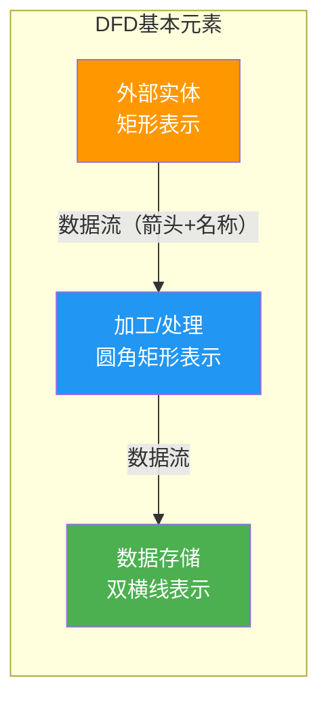

**DFD 分层结构**：

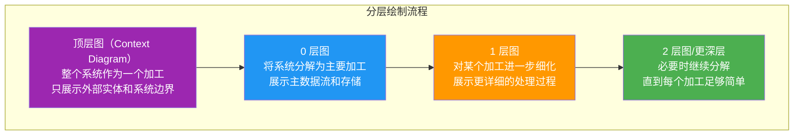

**DFD 绘制的核心规则（考试重点）**：

**规则一：数据守恒（最重要）**
- 加工的**输入数据流**必须足够产生**输出数据流**。
- 即：输入 → 加工 → 输出，数据不能凭空产生，也不能凭空消失。
- **违反示例**：一个加工只有输入没有输出（数据"黑洞"），或只有输出没有输入（数据"奇迹"）。

**规则二：父图与子图平衡**
- 0 层图（子图）中某个加工的输入/输出数据流，必须与上一层（父图）中该加工的输入/输出数据流一致。
- 即：**父图中某个加工的边界 = 子图的整体边界**。

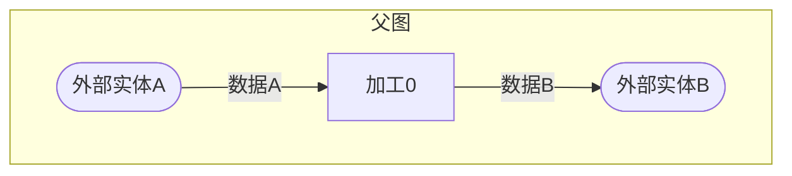

↓ 分解加工0 ↓

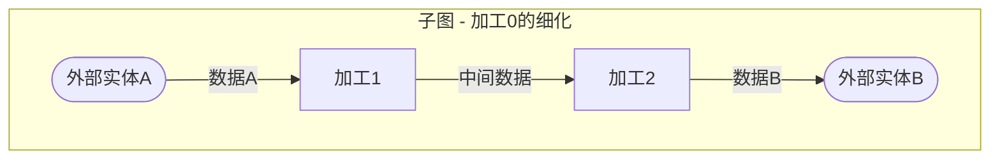
> 父图有"数据A进、数据B出"，子图也必须是"数据A进、数据B出"，中间的内部数据流不算。

**规则三：加工必须有编号**
- 顶层加工编号通常为 0（或不编号，代表整个系统）。
- 0 层图加工编号为 1、2、3...
- 1 层图中加工 1 的子加工编号为 1.1、1.2、1.3...

**规则四：数据流的命名**
- 每条数据流必须有名称（不能用"数据""信息"等模糊词）。
- 数据流名称是名词或名词短语，描述流动的数据内容。
- 加工之间的数据流不能重名（除非确实是同一组数据）。

**规则五：数据存储的连接**
- 数据存储只能被**加工**读写，不能直接与外部实体或另一个数据存储相连。
- 外部实体必须通过加工间接访问数据存储。

**规则六：加工的分解**
- 一个加工分解后，子加工数量一般为 **3~7 个**（太少没必要，太多难以理解）。
- 分解到每个加工的功能足够清晰、可以用一个自然语言段落描述为止。

**规则七：避免常见错误**

| 错误类型 | 说明 | 正确做法 |
|----------|------|----------|
| 黑洞 | 加工有输入无输出 | 每个加工必须有输入和输出 |
| 奇迹 | 加工有输出无输入 | 输出必须由输入数据产生 |
| 灰洞 | 输入不足以产生输出 | 输入数据必须足以产生输出 |
| 外部实体直连存储 | 外部实体直接连数据存储 | 必须经过加工 |
| 无名数据流 | 数据流没有名称 | 每条数据流必须命名 |
| 交叉数据流 | 数据流线条交叉 | 合理布局避免交叉 |

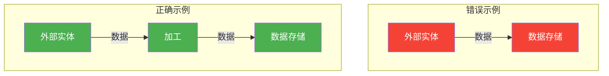
> ❌ 外部实体不能直接连接数据存储 ✅ 必须通过加工中转

**DFD 分层绘制完整示例（图书管理系统）**：

**顶层图**（整个系统视为一个加工，只展示外部实体和数据流边界）：

```mermaid
graph LR
    Reader(["读者"]) -->|"借还请求"| System["图书管理系统"]
    System -->|"借还结果"| Reader
    System -->|"统计报表"| Admin(["管理员"])
    Admin -->|"系统管理"| System
    style Reader fill:#FF9800,color:#fff
    style Admin fill:#FF9800,color:#fff
    style System fill:#2196F3,color:#fff
```

**0 层图**（将"图书管理系统"分解为4个加工，父子图边界一致：读者↔借还请求/结果、管理员↔统计报表/系统管理）：

```mermaid
graph TD
    Reader(["读者"]) -->|借阅请求| P1["1.借阅处理"]
    Reader -->|还书请求| P2["2.还书处理"]
    P1 -->|借阅记录| DS1[("借阅记录")]
    P2 -->|还书记录| DS1
    DS2[("图书信息")] -->|图书状态| P1
    P2 -->|更新状态| DS2
    Reader -->|查询请求| P3["3.图书查询"]
    DS2 -->|图书信息| P3
    P3 -->|查询结果| Reader
    Admin(["管理员"]) -->|查询条件| P4["4.统计报表"]
    DS1 -->|借阅数据| P4
    P4 -->|统计报表| Admin
    style Reader fill:#FF9800,color:#fff
    style Admin fill:#FF9800,color:#fff
    style P1 fill:#2196F3,color:#fff
    style P2 fill:#2196F3,color:#fff
    style P3 fill:#2196F3,color:#fff
    style P4 fill:#2196F3,color:#fff
    style DS1 fill:#4CAF50,color:#fff
    style DS2 fill:#4CAF50,color:#fff
```
> 📊 顶层 → 0 层：父图边界（读者输入借还请求、管理员查询报表）与子图一致

```mermaid
erDiagram
    CUSTOMER ||--o{ ORDER : places
    ORDER ||--|{ ORDER_ITEM : contains
    PRODUCT ||--o{ ORDER_ITEM : "included in"
    CUSTOMER {
        int id PK
        string name
        string phone
    }
    ORDER {
        int id PK
        int customer_id FK
        date order_date
        string status
    }
    ORDER_ITEM {
        int id PK
        int order_id FK
        int product_id FK
        int quantity
    }
    PRODUCT {
        int id PK
        string name
        float price
        int stock
    }
```
> 📊 ER图示例：电商系统实体关系

```mermaid
stateDiagram-v2
    [*] --> 空闲
    空闲 --> 处理中: 收到订单
    处理中 --> 已确认: 库存充足
    处理中 --> 已取消: 库存不足
    已确认 --> 配送中: 发货
    配送中 --> 已完成: 签收
    已取消 --> [*]
    已完成 --> [*]
```
> 📊 状态转换图（STD）示例：订单状态流转

**结构化设计（SD）**：
- 将分析模型转换为软件结构。
- **模块化**：将系统分解为高内聚、低耦合的模块。
- **内聚类型**（从低到高）：
  - 偶然内聚、逻辑内聚、时间内聚、过程内聚、通信内聚、顺序内聚、功能内聚。
- **耦合类型**（从高到低）：
  - 内容耦合、公共耦合、外部耦合、控制耦合、标记耦合、数据耦合、非直接耦合。
- **结构图**：描述模块间的调用关系。

> **真题考点：模块内聚与耦合（高频）**
> - **数据耦合**：通过参数传递基本数据类型，耦合最低（A）。（2012/2025 真题）
> - **控制耦合**：传递控制信息（标志位、开关量）。
> - **公共耦合**：共享全局变量。
> - **内容耦合**：直接访问另一模块内部数据，耦合最高。
> - 内聚从低到高：偶然→逻辑→时间→过程→通信→顺序→**功能**
> - 模块内各部分没什么联系且接收控制参数 → **逻辑内聚**（B）。（2020 真题）
> - 顺序内聚在给定选项中内聚度最高（D）。（真题）
> - **高内聚低耦合**是设计原则，耦合越低越好（非越高越好）。（2025 真题）

> **真题考点：结构化设计 vs 面向对象分析**
> - 结构化方法和面向对象方法**都使用抽象**，区别在于抽象方式不同。（2020 真题）
> - 概要设计确定**软件系统总体结构和模块间关系**（B）。（真题）
> - 详细设计确定**模块的算法和数据结构**（B）。（真题）

```mermaid
graph LR
    subgraph 内聚强度从低到高
        direction TB
        C1[偶然内聚] --> C2[逻辑内聚] --> C3[时间内聚] --> C4[过程内聚] --> C5[通信内聚] --> C6[顺序内聚] --> C7[功能内聚]
    end
    style C1 fill:#f44336,color:#fff
    style C2 fill:#FF5722,color:#fff
    style C3 fill:#FF9800,color:#fff
    style C4 fill:#FFC107,color:#fff
    style C5 fill:#CDDC39,color:#333
    style C6 fill:#8BC34A,color:#fff
    style C7 fill:#4CAF50,color:#fff
```

```mermaid
graph LR
    subgraph 耦合强度从高到低
        direction TB
        D1[内容耦合] --> D2[公共耦合] --> D3[外部耦合] --> D4[控制耦合] --> D5[标记耦合] --> D6[数据耦合] --> D7[非直接耦合]
    end
    style D1 fill:#f44336,color:#fff
    style D2 fill:#FF5722,color:#fff
    style D3 fill:#FF9800,color:#fff
    style D4 fill:#FFC107,color:#fff
    style D5 fill:#CDDC39,color:#333
    style D6 fill:#8BC34A,color:#fff
    style D7 fill:#4CAF50,color:#fff
```
> 📊 内聚（越高越好）与耦合（越低越好）等级对比

```mermaid
graph TD
    A[主控模块] --> B[获取输入]
    A --> C[数据处理]
    A --> D[输出结果]
    C --> E[计算A]
    C --> F[计算B]
    C --> G[校验数据]
    B --> H[读取文件]
    B --> I[格式转换]
    D --> J[生成报表]
    D --> K[显示结果]
    style A fill:#9C27B0,color:#fff
    style B fill:#2196F3,color:#fff
    style C fill:#2196F3,color:#fff
    style D fill:#2196F3,color:#fff
```
> 📊 结构图示例：模块间调用层次关系

### 4.2 面向对象方法

**面向对象的基本概念**：
- **对象**：数据和操作的封装体。
- **类**：具有相同属性和操作的对象集合。
- **封装**：隐藏内部实现细节，通过接口访问。
- **继承**：子类自动获得父类的属性和方法。
- **多态**：同一消息可以产生不同的行为（重载和覆盖）。

> **真题考点：面向对象方法（高频）**
> - **封装**实现信息隐蔽（①C）；**信息隐蔽**是软件设计原则（②C）；**最小界面**原则（③B）；**继承**实现代码复用（④B）。（真题）
> - 对象之间通信通过**消息传递**（C）实现。（真题）
> - 多态：不同类对象对同一消息做出不同响应（D）。（真题）
> - 类是对象的**抽象**，对象是类的**实例**。（真题）
> - 不同对象**不能**具有相同标识（OID 全局唯一）。（2012 真题）
> - 4+1 视图模型：逻辑视图、开发视图、进程视图、物理视图 + **场景视图**。（真题）
> - 对象在运行时**不是**都始终处于活动状态。（真题）
> - 教师是学校的一部分 → **聚合**关系（A），非泛化/依赖。（2012 真题）

**统一建模语言（UML）**：
- **用例图**：描述系统功能和参与者。
- **类图**：描述类的结构、属性、操作及类间关系（关联、聚合、组合、泛化/继承、依赖）。
- **对象图**：类图的实例。
- **顺序图（时序图）**：描述对象间消息的时间顺序。
- **协作图（通信图）**：强调对象间的组织结构关系。
- **状态图**：描述对象的状态转换。
- **活动图**：描述工作流和活动流程。
- **组件图**：描述组件间的依赖关系。
- **部署图**：描述硬件节点和软件的部署。

```mermaid
graph TD
    subgraph UML14[UML 2.0 14种图]
        subgraph 结构图[结构图 6种]
            C1[类图]
            C2[对象图]
            C3[组件图]
            C4[部署图]
            C5[包图]
            C6[组合结构图]
        end
        subgraph 行为图[行为图 8种]
            B1[用例图]
            B2[活动图]
            B3[状态机图]
            B4[顺序图]
            B5[通信图]
            B6[定时图]
            B7[交互概览图]
            B8[综合图]
        end
    end
    style 结构图 fill:#E3F2FD,stroke:#2196F3
    style 行为图 fill:#FFF3E0,stroke:#FF9800
    style C1 fill:#2196F3,color:#fff
    style B1 fill:#FF9800,color:#fff
    style B4 fill:#FF9800,color:#fff
```
> 📊 UML 2.0 图形分类总览

```mermaid
graph LR
    User((用户)) -->|登录| UC1((登录系统))
    User -->|查询| UC2((查询订单))
    User -->|下单| UC3((提交订单))
    Admin((管理员)) -->|管理| UC4((管理商品))
    Admin -->|审核| UC5((审核订单))
    UC3 -.->|include| UC6((验证库存))
    UC1 -.->|extend| UC7((找回密码))
    style User fill:#FF9800,color:#fff
    style Admin fill:#9C27B0,color:#fff
    style UC1 fill:#4CAF50,color:#fff
    style UC2 fill:#4CAF50,color:#fff
    style UC3 fill:#4CAF50,color:#fff
    style UC4 fill:#4CAF50,color:#fff
    style UC5 fill:#4CAF50,color:#fff
    style UC6 fill:#2196F3,color:#fff
    style UC7 fill:#2196F3,color:#fff
```
> 📊 用例图示例：电商系统

```mermaid
classDiagram
    class Animal {
        +String name
        +int age
        +void eat()
        +void sleep()
    }
    class Dog {
        +String breed
        +void bark()
    }
    class Cat {
        +String color
        +void meow()
    }
    class Owner {
        +String name
        +void feed()
    }
    class Kennel {
        +String location
    }

    Animal <|-- Dog : 继承/泛化
    Animal <|-- Cat : 继承/泛化
    Owner "1" --> "*" Animal : 关联
    Owner "1" *-- "1" Kennel : 组合
    Dog o-- Kennel : 聚合
    Animal ..> Owner : 依赖

    note for Animal "abstract 抽象类"
```
> 📊 类图示例：UML类间关系（泛化、关联、组合、聚合、依赖）

```mermaid
sequenceDiagram
    participant U as 用户
    participant C as :Controller
    participant S as :Service
    participant D as :DAO

    U->>C: 提交订单(orderInfo)
    activate C
    C->>S: createOrder(orderInfo)
    activate S
    S->>D: save(order)
    activate D
    D-->>S: orderId
    deactivate D
    S-->>C: 订单创建成功
    deactivate S
    C-->>U: 返回订单号
    deactivate C
```
> 📊 顺序图（时序图）示例：订单提交流程

```mermaid
stateDiagram-v2
    [*] --> 空闲
    空闲 --> 等待密码 : 插入银行卡
    等待密码 --> 验证中 : 输入密码
    验证中 --> 操作选择 : 验证通过
    验证中 --> 等待密码 : 验证失败
    验证中 --> 吞卡 : 连续3次失败
    操作选择 --> 取款 : 选择取款
    操作选择 --> 查询余额 : 选择查询
    取款 --> 操作选择 : 完成
    查询余额 --> 操作选择 : 完成
    操作选择 --> 空闲 : 退出
    吞卡 --> [*]
```
> 📊 状态图示例：ATM机状态转换

```mermaid
flowchart TD
    A([开始]) --> B[接收订单]
    B --> C{有库存?}
    C -->|是| D[扣减库存]
    C -->|否| E[通知缺货]
    E --> F([结束])
    D --> G[生成发货单]
    G --> H[安排配送]
    H --> I[更新状态]
    I --> F
    style A fill:#4CAF50,color:#fff
    style C fill:#FF9800,color:#fff
    style F fill:#f44336,color:#fff
```
> 📊 活动图示例：订单处理工作流

**面向对象分析（OOA）**：
- 识别类和对象、确定结构、定义属性和操作、定义对象间关系。
- 使用用例驱动。

**面向对象设计（OOD）**：
- 将分析模型转化为设计模型。
- 设计模式（Design Patterns）：
  - 创建型：工厂方法、抽象工厂、单例、建造者、原型。
  - 结构型：适配器、桥接、组合、装饰、外观、享元、代理。
  - 行为型：责任链、命令、解释器、迭代器、中介者、备忘录、观察者、状态、策略、模板方法、访问者。

---

## （五）软件测试

### 5.1 软件测试的概念

- **目的**：发现程序中的错误。好的测试用例是能发现未发现错误的用例。
- **原则**：
  - 测试不能证明无错（Dijkstra）。
  - 测试要尽早开始。
  - 注意群集现象（Pareto 原则：80%的错误集中在20%的模块中）。
  - 避免自己测试自己的程序。

> **真题考点：软件测试**
> - **黑盒测试**根据**功能规格说明**（B）设计测试用例，关注功能是否符合需求，不看内部逻辑。（真题）
> - **白盒测试**根据程序内部逻辑设计测试用例。
> - **单元测试**主要发现模块**内部**错误，不是模块接口之间的错误（接口错误属于**集成测试**）。（真题）
> - 软件测试过程模型给出的是**软件测试的要素及它们之间的关系**（B）。（2012 真题）

### 5.2 测试过程模型

- **V 模型**：需求分析 ↔ 验收测试、概要设计 ↔ 系统测试、详细设计 ↔ 集成测试、编码 ↔ 单元测试。
- **测试阶段**：
  1. **单元测试**：测试单个模块。使用驱动模块和桩模块。
  2. **集成测试**：测试模块间的接口。
     - 自顶向下（需桩模块）、自底向上（需驱动模块）、混合策略。
  3. **系统测试**：测试整个系统是否满足需求规约。
  4. **验收测试**：由用户验证系统是否满足业务需求。

```mermaid
graph TD
    subgraph dev["开发阶段"]
        A[需求分析] --> B[概要设计]
        B --> C[详细设计]
        C --> D[编码实现]
    end
    subgraph test["测试阶段"]
        D --> E[单元测试]
        E --> F[集成测试]
        F --> G[系统测试]
        G --> H[验收测试]
    end
    A -.->|对应| H
    B -.->|对应| G
    C -.->|对应| F
    D -.->|对应| E
    style A fill:#4CAF50,color:#fff
    style B fill:#2196F3,color:#fff
    style C fill:#2196F3,color:#fff
    style D fill:#FF9800,color:#fff
    style E fill:#f44336,color:#fff
    style F fill:#f44336,color:#fff
    style G fill:#f44336,color:#fff
    style H fill:#9C27B0,color:#fff
```
> 📊 V模型：开发阶段与测试阶段对应关系

### 5.3 白盒测试技术

**基于程序内部逻辑结构设计测试用例**。

- **语句覆盖**：每条语句至少执行一次（最弱）。
- **判定覆盖（分支覆盖）**：每个判定的每个分支至少执行一次。
- **条件覆盖**：每个条件的真假至少取一次。
- **判定-条件覆盖**：同时满足判定覆盖和条件覆盖。
- **条件组合覆盖**：每个判定中条件的所有可能组合至少执行一次（最强之一）。
- **路径覆盖**：覆盖所有可能的执行路径（最强但可能不可行）。
- **基本路径测试（McCabe）**：
  - **圈复杂度 V(G)** = E - N + 2（E为边数，N为节点数）= 判定节点数 + 1
  - V(G) 确定独立路径数，据此设计测试用例。

```mermaid
graph LR
    subgraph 覆盖强度从弱到强
        direction TB
        T1[语句覆盖] --> T2[判定覆盖] --> T3[条件覆盖] --> T4[判定-条件覆盖] --> T5[条件组合覆盖] --> T6[路径覆盖]
    end
    style T1 fill:#f44336,color:#fff
    style T2 fill:#FF5722,color:#fff
    style T3 fill:#FF9800,color:#fff
    style T4 fill:#FFC107,color:#fff
    style T5 fill:#8BC34A,color:#fff
    style T6 fill:#4CAF50,color:#fff
```
> 📊 白盒测试覆盖标准强度对比（从弱到强）

```mermaid
flowchart TD
    A((1)) --> B{2: x > 0?}
    B -->|T| C{3: y > 0?}
    B -->|F| D((4))
    C -->|T| E((5))
    C -->|F| F((6))
    D --> G((7))
    E --> G
    F --> G
    style A fill:#4CAF50,color:#fff
    style B fill:#FF9800,color:#fff
    style C fill:#FF9800,color:#fff
    style G fill:#f44336,color:#fff
```
> 📊 基本路径测试示例：程序控制流图（V(G) = 判定节点数+1 = 3，有3条独立路径）

### 5.4 黑盒测试技术

**基于规格说明设计测试用例，不考虑内部结构**。

- **等价类划分**：将输入域划分为有效等价类和无效等价类，每类选一个代表。
- **边界值分析**：测试边界条件（等价类边界的值）。
- **因果图**：分析输入条件的因果关系，生成测试用例。
- **错误推测法**：基于经验推测可能的错误。
- **判定表/判定树**：处理复杂逻辑条件组合。

```mermaid
graph TD
    subgraph valid["有效等价类"]
        V1["1 ~ 100 之间的整数"]
    end
    subgraph invalid["无效等价类"]
        IV1["小于1的整数"]
        IV2["大于100的整数"]
        IV3["非整数或非数字"]
    end
    Root["等价类划分示例: 输入1到100的整数"] --> valid
    Root --> invalid
    style Root fill:#9C27B0,color:#fff
    style V1 fill:#4CAF50,color:#fff
    style IV1 fill:#f44336,color:#fff
    style IV2 fill:#f44336,color:#fff
    style IV3 fill:#f44336,color:#fff
```
> 📊 等价类划分与边界值分析示意

```mermaid
graph LR
    subgraph 黑盒测试方法对比
        direction TB
        M1[等价类划分<br/>按类别选代表] --> M2[边界值分析<br/>测试边界值]
        M2 --> M3[因果图<br/>分析逻辑关系]
        M3 --> M4[判定表<br/>处理复杂组合]
        M4 --> M5[错误推测<br/>基于经验]
    end
    style M1 fill:#4CAF50,color:#fff
    style M2 fill:#2196F3,color:#fff
    style M3 fill:#FF9800,color:#fff
    style M4 fill:#9C27B0,color:#fff
    style M5 fill:#f44336,color:#fff
```

---

## （六）软件工程管理

### 6.1 软件工程管理活动

- **项目计划**：制定项目进度、资源分配、风险评估。
- **项目跟踪与监控**：监控项目进展，确保按计划执行。
- **配置管理**：管理软件产品的变更。
  - 配置项识别、版本控制、变更控制、配置审计、状态报告。
- **质量管理**：确保软件质量。
- **风险管理**：识别、分析、规划应对措施。
- **人员管理**：团队组织和协调。

### 6.2 软件规模、开发成本和进度估算

**规模估算**：
- **代码行（LOC）**：直接统计代码行数。
- **功能点分析（FP）**：基于外部输入、外部输出、外部查询、内部逻辑文件、外部接口文件。
  - FP = UFP × VAF（未调整功能点 × 调整因子）。

> **真题考点：项目管理**
> - 用于估算项目规模的方法是**功能点分析法**（B），甘特图用于进度管理，挣值分析用于成本监控。（真题）
> - CMMI 既支持**连续性**过程改进，也支持**阶段性**过程改进。（真题）

**成本估算**：
- **代码行估算法**：LOC × 每行成本。
- **功能点估算法**：FP × 每功能点成本。
- **COCOMO 模型（构造性成本模型）**：
  - 基本 COCOMO：工作量 = a × KLOC^b
  - 中等 COCOMO：考虑 15 个成本驱动因子。
  - 详细 COCOMO：进一步按阶段分解。

**进度估算**：
- **甘特图（Gantt Chart）**：直观显示任务的时间安排。
- **PERT/CPM（关键路径法）**：
  - 活动图：节点或箭头表示活动。
  - 关键路径：最长路径，决定项目最短完成时间。
  - 最早开始时间（ES）、最早完成时间（EF）、最迟开始时间（LS）、最迟完成时间（LF）。
  - 时差 = LS - ES = LF - EF。时差为 0 的活动在关键路径上。

```mermaid
gantt
    title 项目开发甘特图
    dateFormat  YYYY-MM-DD
    section 需求阶段
    需求分析       :a1, 2024-01-01, 10d
    需求评审       :after a1, 3d
    section 设计阶段
    概要设计       :b1, after a1, 7d
    详细设计       :b2, after b1, 10d
    section 编码阶段
    编码实现       :c1, after b2, 20d
    代码评审       :c2, after c1, 3d
    section 测试阶段
    集成测试       :d1, after c2, 10d
    系统测试       :d2, after d1, 7d
    验收测试       :d3, after d2, 5d
```
> 📊 甘特图示例：项目进度时间安排

```mermaid
graph LR
    A["A 需求分析<br/>ES=0 EF=3<br/>LS=0 LF=3<br/>时差=0"] --> B["B 概要设计<br/>ES=3 EF=7<br/>LS=3 LF=7<br/>时差=0"]
    A --> C["C 技术调研<br/>ES=3 EF=5<br/>LS=5 LF=7<br/>时差=2"]
    B --> D["D 详细设计<br/>ES=7 EF=11<br/>LS=7 LF=11<br/>时差=0"]
    C --> D
    D --> E["E 编码实现<br/>ES=11 EF=17<br/>LS=11 LF=17<br/>时差=0"]
    E --> F["F 系统测试<br/>ES=17 EF=20<br/>LS=17 LF=20<br/>时差=0"]
    style A fill:#f44336,color:#fff
    style B fill:#f44336,color:#fff
    style C fill:#FF9800,color:#fff
    style D fill:#f44336,color:#fff
    style E fill:#f44336,color:#fff
    style F fill:#f44336,color:#fff
```
> 📊 PERT图示例：红色为关键路径（A→B→D→E→F，时差均为0），橙色C为非关键活动（时差=2）

---

## （七）软件质量、质量特征以及软件质量保证

### 7.1 软件质量的概念及质量模型

**ISO/IEC 9126 质量模型（六个特性）**：

```mermaid
graph TD
    ISO["ISO/IEC 9126<br/>软件质量模型"] --> F["功能性<br/>适合性·准确性<br/>互操作性·依从性·安全性"]
    ISO --> R["可靠性<br/>成熟性·容错性<br/>易恢复性"]
    ISO --> U["易用性<br/>易理解性·易学性<br/>易操作性"]
    ISO --> E["效率<br/>时间特性·资源特性"]
    ISO --> M["可维护性<br/>易分析性·易改变性<br/>稳定性·易测试性"]
    ISO --> P["可移植性<br/>适应性·易安装性<br/>遵循性·易替换性"]
    style ISO fill:#9C27B0,color:#fff
    style F fill:#4CAF50,color:#fff
    style R fill:#2196F3,color:#fff
    style U fill:#FF9800,color:#fff
    style E fill:#f44336,color:#fff
    style M fill:#00BCD4,color:#fff
    style P fill:#795548,color:#fff
```
> 📊 ISO/IEC 9126 软件质量模型六大特性

| 特性 | 子特性 |
|------|--------|
| **功能性** | 适合性、准确性、互操作性、依从性、安全性 |
| **可靠性** | 成熟性、容错性、易恢复性 |
| **易用性** | 易理解性、易学性、易操作性 |
| **效率** | 时间特性、资源特性 |
| **可维护性** | 易分析性、易改变性、稳定性、易测试性 |
| **可移植性** | 适应性、易安装性、遵循性、易替换性 |

### 7.2 软件质量保证活动

- **质量保证（QA）**：确保软件过程和产品符合标准和要求的系统性活动。
- **主要活动**：
  - 制定质量保证计划。
  - 参与技术评审和审计。
  - 监控软件工程过程。
  - 报告和处理不符合项。
  - 建立质量度量体系。
- **软件评审**：
  - 技术评审：检查技术方案。
  - 走查（Walkthrough）：非正式地检查代码或文档。
  - 审查（Inspection）：最正式的评审方法（Fagan 审查法）。
- **验证与确认（V&V）**：
  - **验证（Verification）**：是否正确地构建了产品？（过程检查）
  - **确认（Validation）**：是否构建了正确的产品？（结果检查）

```mermaid
graph LR
    subgraph V&V[验证与确认 V&V]
        V["验证 Verification<br/>是否正确地构建了产品？<br/>─── 过程检查 ───"]
        A["确认 Validation<br/>是否构建了正确的产品？<br/>─── 结果检查 ───"]
    end
    V ---|过程角度| Dev[开发过程中的<br/>评审/审查/测试]
    A ---|用户角度| User[用户验收<br/>是否满足需求]
    style V fill:#2196F3,color:#fff
    style A fill:#FF9800,color:#fff
    style Dev fill:#E3F2FD
    style User fill:#FFF3E0
```
> 📊 验证（Verification）vs 确认（Validation）

---

## （八）CASE 工具与环境

### 8.1 CASE 的分类

**按功能分类**：
- **上游 CASE（前端）**：支持分析和设计阶段（需求分析工具、设计工具）。
- **下游 CASE（后端）**：支持实现和测试阶段（代码生成器、测试工具）。
- **集成 CASE**：覆盖整个软件生存周期。

```mermaid
graph LR
    subgraph CASE分类
        direction TB
        Up["上游 CASE<br/>分析·设计<br/>需求分析工具·建模工具"]
        Down["下游 CASE<br/>实现·测试<br/>代码生成器·测试工具"]
        All["集成 CASE<br/>覆盖整个生存周期"]
    end
    Up --> Down
    All -.-> Up
    All -.-> Down
    style Up fill:#4CAF50,color:#fff
    style Down fill:#2196F3,color:#fff
    style All fill:#9C27B0,color:#fff
```

**按支持范围分类**：
- **工具**：支持单个任务。
- **工作台**：支持某一过程阶段。
- **环境**：支持整个开发过程。

```mermaid
graph TD
    T["工具 Tool<br/>支持单个任务<br/>例：编译器"] --> W["工作台 Workbench<br/>支持某一阶段<br/>例：测试工作台"]
    W --> E["环境 Environment<br/>支持整个开发过程<br/>例：集成开发环境"]
    style T fill:#4CAF50,color:#fff
    style W fill:#2196F3,color:#fff
    style E fill:#9C27B0,color:#fff
```

### 8.2 集成化 CASE 环境的概念

- **集成化 CASE 环境**：将多种 CASE 工具有机集成，提供统一的开发支持。
- **集成层次**：
  - **数据集成**：工具间共享数据（通过公共仓库/数据库）。
  - **控制集成**：工具间的通信和协调。
  - **界面集成**：统一的用户界面。

```mermaid
graph TD
    subgraph 集成化CASE环境
        UI["界面集成<br/>统一用户界面"]
        Ctrl["控制集成<br/>工具间通信协调"]
        Data["数据集成<br/>公共仓库/数据库"]
    end
    UI --> Ctrl
    Ctrl --> Data
    Tool1[建模工具] --> UI
    Tool2[编码工具] --> UI
    Tool3[测试工具] --> UI
    Tool4[管理工具] --> UI
    Data --> Repo[(数据仓库<br/>Repository)]
    style UI fill:#9C27B0,color:#fff
    style Ctrl fill:#2196F3,color:#fff
    style Data fill:#4CAF50,color:#fff
    style Repo fill:#FF9800,color:#fff
```
> 📊 集成化CASE环境的三个集成层次

### 8.3 CASE 环境的模型

- **参考模型**：ECMA（欧洲计算机厂商协会）提出的 CASE 环境参考模型 NIST/ECMA。
- **数据仓库（Repository）**：集中存储软件开发过程中所有信息的数据库，是集成化的核心。
- **典型 CASE 工具**：需求管理工具（DOORS）、建模工具（Enterprise Architect、Rose）、配置管理工具（Git、SVN）、测试工具（JUnit、LoadRunner）、项目管理工具（Jira）。
